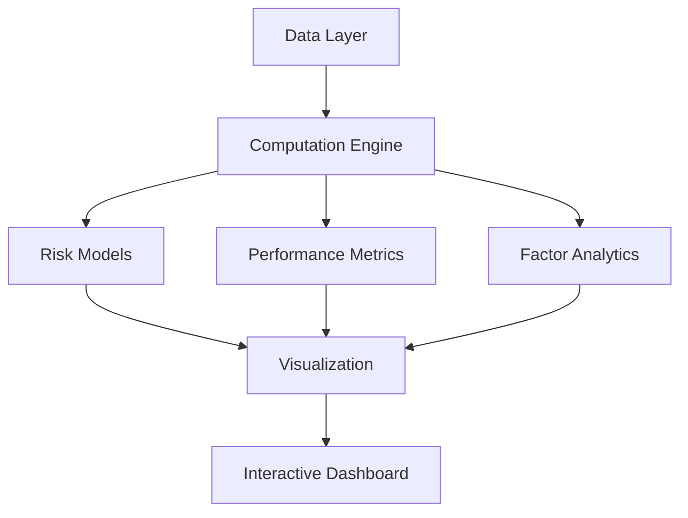

# 📈 S&P 500 Portfolio Analysis Dashboard


[](LICENSE)

Professional portfolio analysis tool for quantitative researchers and portfolio managers, featuring real-time risk metrics and factor exposure analysis.


## 🌟 Key Features

### 📊 Core Modules
| Module                     | Highlights                                                   | Tech Implementation                          |
| -------------------------- | ------------------------------------------------------------ | -------------------------------------------- |
| **Portfolio Construction** | 3 Weighting Modes:<br>- Equal Weighting<br>- Custom Allocation<br>- CSV Upload | `Streamlit Widgets`<br>`Pandas Validation`   |
| **Performance Analysis**   | Cumulative Returns Tracking<br>Sector Allocation Breakdown   | `Plotly`<br>`Interactive Charts`             |
| **Risk Management**        | Value-at-Risk (VaR)<br>Max Drawdown Analysis<br>Dynamic Sharpe Ratio | `Quantile Regression`<br>`Rolling Windows`   |
| **Factor Analytics**       | Exposure Comparison vs SP500<br>Risk Contribution Decomposition | `Matrix Operations`<br>`Covariance Analysis` |


## 🚀 Quick Start

### Prerequisites
- Python 3.9+
- Required data files in `/data` directory:
  ```bash
  data/
  ├── Constituent_Price_History.csv
  ├── Static_Data.xlsx
  ├── Factor_Covariance_Matrix.xlsx
  ├── Factor_Exposures.xlsx
  └── FF.csv

### Installation

```bash
# Create virtual environment
python -m venv venv
source venv/bin/activate  # Linux/Mac
venv\Scripts\activate    # Windows

# Install dependencies
pip install -r requirements.txt

# Launch dashboard
streamlit run app.py
```


## 📂 Data Requirements

### File Specifications

|     File      | Format |           Required Columns            |
| :-----------: | :----: | :-----------------------------------: |
|  Price Data   |  CSV   |          `date, code, value`          |
|  Static Data  | Excel  |        `ticker, sector, name`         |
| Factor Matrix | Excel  | Covariance matrix with factor headers |

## 🛠️ Usage Guide

### 1. Portfolio Construction


- **Stock Selection**: Multi-search supported
- Weight Modes:
  - Equal Weighting: Auto-balanced allocation
  - Custom Weights: Slider-based allocation
  - CSV Upload: Template available at `/examples/weights_template.csv`

### 2. Performance Analysis

```python
# Sample code: Cumulative returns calculation
cum_returns = (1 + returns_df['portfolio_ret']).cumprod()
```

### 3. Risk Metrics

|  Metric  |      Formula       |    Implementation     |
| :------: | :----------------: | :-------------------: |
| VaR(95%) | `P(R ≤ -VaR) = 5%` | Historical Simulation |
|   CVaR   | `E[R | R ≤ -VaR]`  |  Conditional Average  |


## 🧩 Technical Architecture





## 🤝 Contributing

We welcome contributions through:

1. Bug reports via GitHub Issues
2. Feature requests using the issue template
3. Code contributions via Pull Requests

**Development Guidelines**:

- Follow PEP8 style guide
- Add unit tests for new features
- Document public methods using Google-style docstrings

## 📜 License

Distributed under the MIT License. See LICENSE for more information.